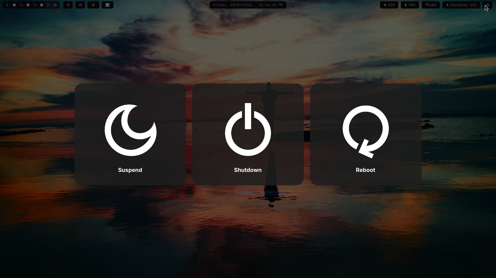

# 🌙 My Hyprland Dotfiles

A clean, productive, and slightly sarcastic Hyprland setup.

## 🚀 Components

- **Window Manager:** [Hyprland](https://hyprland.org/) (with NVIDIA optimizations)
- **Shell:** [Fish](https://fishshell.com/) (Custom prompt + funny startup messages)
- **Terminal:** [Kitty](https://sw.kovidgoyal.net/kitty/)
- **Status Bar:** [Waybar](https://github.com/Alexays/Waybar) (Full & Compact modes)
- **Launcher:** [Fuzzel](https://codeberg.org/dnkl/fuzzel)
- **Logout Menu:** [wleave](https://github.com/C-Aniruddh/wleave)
- **Notifications:** [Dunst](https://dunst-project.org/)
- **Idle Daemon:** [Hypridle](https://github.com/hyprwm/hypridle)
- **Wallpaper:** [swww](https://github.com/L_S_X/swww)
- **File Manager:** Thunar

## 🛠️ Features & Scripts

These dotfiles include custom scripts for a better workflow:

- **📊 Bar Toggle:** Quickly switch between a `full` and `compact` Waybar layout.
- **󰿢 Grayscale Mode:** Toggle a grayscale shader for focus or late-night sessions.
- **⚡ Power Mode:** Toggle animations and blur to save battery or boost performance.
- **🤡 Sassy Shell:** A Fish shell prompt that reacts to your commands (and judges you when they fail).

## ⌨️ Keybindings

The `SUPER` (Windows) key is the main modifier.

| Keybind | Action |
| --- | --- |
| `SUPER + T` | Open Kitty Terminal |
| `SUPER + Space` | App Launcher (Fuzzel) |
| `SUPER + ESC` | Logout Menu (wleave) |
| `SUPER + Q` | Kill Active Window |
| `SUPER + W` | Open Brave Browser |
| `SUPER + C` | Open VS Code |
| `SUPER + E` | Open File Manager (Thunar) |
| `SUPER + F` | Toggle Floating |
| `PrintScreen` | Full Screenshot (Save + Clipboard) |
| `Shift + PrintScreen` | Region Screenshot (Clipboard) |

## 📦 Installation

1. Clone the repository:
   ```bash
   git clone https://github.com/vijaygovindBiju/devforge.git ~/dotfiles
   ```
2. Symlink the configurations to `~/.config/`:
   ```bash
   ln -s ~/dotfiles/hypr ~/.config/hypr
   ln -s ~/dotfiles/waybar ~/.config/waybar
   ln -s ~/dotfiles/fish ~/.config/fish
   # ... and so on for other directories
   ```
3. Make sure to install the required fonts located in `hypr/Fonts/`.

## 🎨 Screenshots




---
*Built with ❤️ and a lot of trial & error.*
